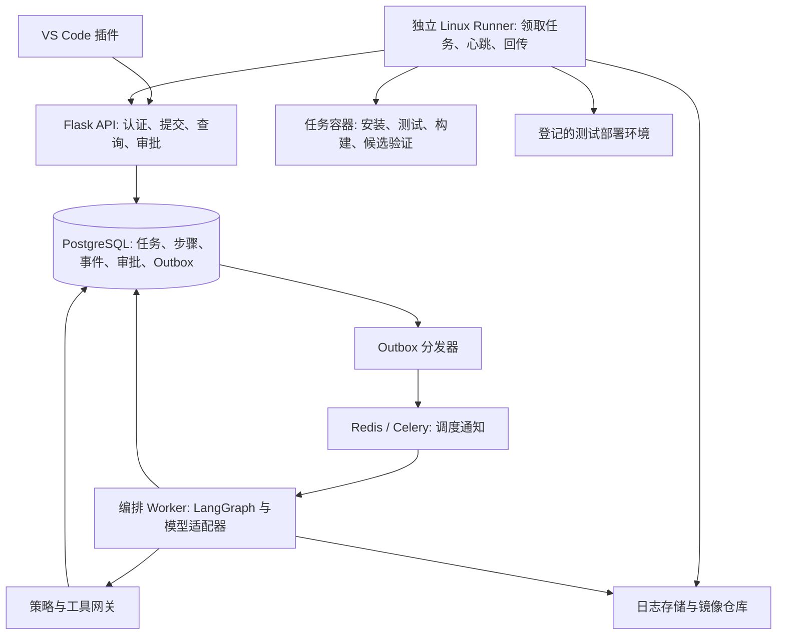

# AI 软件交付 Agent 落地方案

日期：2026-09-17。状态：设计提案，本文不代表相关能力已经实现。

## 1. 推荐方向与做成的标准

推荐在现有项目上升级为“面向小型后端团队的测试环境发布与失败修复 Agent”。用户提供仓库、版本和已登记的测试环境，系统读取已有配置、运行测试和发布；失败时收集证据、定位原因、提出有限修复，在隔离环境验证后交给用户审核。成功的配置保存为可重复执行的发布流程。

优先服务已有测试和部署配置、缺少专职运维的小团队。优先解决首次接入、依赖/运行环境变化、启动失败和健康检查失败，而日常成功流程直接按确认过的配置执行。

这是待验证的用户需求，不宣称市场空白。与云效、Coolify、通用编程 Agent 的比较，应落到具体任务的人工时间、准确性、接入成本和重复使用上。

| 方向 | 本次决定 | 理由与代价 |
| --- | --- | --- |
| 全自动多云 DevOps 平台 | 暂不作为目标 | 范围和运维责任太大，个人很难验证全部承诺 |
| 文档问答或日志摘要助手 | 作为辅助能力 | 容易交付，但不能独立证明解决问题的效果 |
| 已有项目的测试环境发布与失败修复 | 主方向 | 能复用现有代码和真实故障；必须做好执行证据和效果评测 |
| 全部推倒重写 | 不采用 | 现有执行链路仍有价值；只替换同步执行、状态存储和环境管理等薄弱部分 |

项目达标意味着：他人在没有作者现场修改代码的情况下可以完成接入；失败有证据；任务中断可解释、可恢复；修复可复测；没有通过测试的版本不会被发布；有独立于开发样例的评测结果。试用版先做到一个团队持续使用，不把它描述为面向任意互联网用户的生产级 SaaS。

## 2. 第一版的明确边界

| 项目 | 第一版承诺 |
| --- | --- |
| 使用者 | 一个受邀团队，2～3 名真实试用者，人工登记仓库和目标环境 |
| 主场景 | 已有测试和 Dockerfile 的 Python HTTP 后端，发布到登记的 Linux Docker 测试环境 |
| 其他语言 | 保留 Java、Node.js 的现有能力与回归测试；Agent 自动修复先不对它们承诺 |
| 其他部署目标 | 保留 server/Azure 适配器；暂不扩展其自动修复和生产发布 |
| 输入 | 仓库、不可变提交、目标环境；失败诊断还可指定已有任务 ID |
| 正常输出 | 版本、测试证据、镜像摘要、发布实例、健康检查、访问入口和阶段耗时 |
| 异常输出 | 失败阶段、证据位置、根因或待验证假设、修复 diff、复测结果及未解决事项 |
| 修改范围 | 已登记的构建/启动配置和部署参数；业务代码问题先定位并交给开发者 |
| 配置缺失 | 说明缺什么并请求补充；不自动补测试来制造“通过” |
| 暂不支持 | 任意陌生仓库、生产数据库迁移、自动删除外部资源、生产流量切换、跨租户共享执行主机 |

选择 Linux 执行环境是为了统一容器和进程管理。Windows 上继续开发插件，后端与 Worker 通过 WSL2 或 Linux 虚拟机开发验证，试用时部署到 Linux。Windows server 脚本的兼容性是后续独立工作。

用户旅程：

1. 管理员一次性登记仓库、测试环境、凭证引用和允许的操作；团队成员不需要每次填写云凭证。
2. 用户在插件中选择项目和版本，输入“发布到测试环境”或“调查任务 X 为什么失败”。
3. 系统展示从文件中得到的配置和执行计划；只追问无法确定的项目根目录、部署方式等信息。
4. 用户确认后异步执行，可关闭插件再回来查看；读日志和在任务沙箱内复测可在授权范围内自动进行。
5. 失败时 Agent 展示证据与修复差异；修改共享环境前确认具体版本和计划，验证失败则不宣称发布成功。

## 3. 现有代码的处理

以下结论来自本次静态检查，不代表已经完成改造或重新联调。

| 现有部分 | 处理方式 |
| --- | --- |
| `backend/routes/tasks.py` | 保留旧 API 兼容入口，新增异步 runs API；当前请求内执行和结束后记历史需要调整 |
| `backend/services/task_executor.py` | 拆成可单独调度的阶段；安装失败应立即停止依赖它的步骤 |
| `backend/services/test_runners/` | 保留语言适配，底层命令移到隔离 Runner；补结构化测试报告 |
| `backend/services/deployers/` | 保留适配接口，Docker 首先补不可变镜像引用、实例归属和版本健康验证 |
| `backend/services/openai_service.py` | 从意图分类入口扩展为模型适配器，提供受约束工具调用和结构化诊断 |
| `backend/services/task_history_service.py` | 保留历史查询；新增执行中状态、步骤和事件，旧数据标记为 legacy |
| `vscode-extension/` | 保留入口和历史功能，增加计划、进度、证据和审核视图 |

当前“命令退出码为零”不足以证明测试确实运行；server 未配置健康 URL 时默认通过，也不能作为可信发布证据。这两项应在新增自主修复前修正。已有同步长请求、子进程环境继承和日志归属问题可转成回归案例。

## 4. 架构与组件职责

采用“显式状态图 + 单 Agent 的有界工具循环”。整体按计划执行；诊断节点根据新证据选择下一项调查工具并调整假设。可以称为带反馈的 Plan-and-Execute，在诊断环节使用 ReAct 式工具交互。无需用多个角色扮演 Agent 才能体现智能体能力。

图中的 Runner 通过认证 API 领取持久化工具任务；不把 Redis、数据库或模型凭证交给被执行的仓库。API 和编排 Worker 不直接执行仓库里的 shell 命令。

| 层次 | 负责什么 | 不承担什么 |
| --- | --- | --- |
| API | 身份、项目与目标权限、请求校验、持久化、任务查询与审批 | 长时间构建、等待服务启动 |
| LangGraph | 计划、诊断循环、等待人工输入、保存推理过程所需的结构化状态 | 队列可靠投递、容器管理、最终权限判断 |
| Celery/Redis | 唤醒编排 Worker，分配待推进的运行 | 业务状态的唯一真相、自动实现“恰好一次” |
| 工具网关 | 校验参数、权限、操作范围、预算、幂等键及证据版本 | 相信模型自己声称获得的授权 |
| Runner | 在指定环境中执行工具，管理生命周期与回传事实 | 自行决定跳过测试或更换发布目标 |
| PostgreSQL | 业务状态、审计与待投递事件；图检查点另表存储 | 保存整段超大日志和镜像二进制 |

任务至少区分 `queued`、`running`、`waiting_tool`、`waiting_input`、`waiting_approval`、`reconciling`、`succeeded`、`failed`、`blocked`、`cancelled`。外部动作结果未知时进入 `reconciling`，不盲目重做，也不显示成功。

## 5. 技术选型及取舍

| 部分 | 决定 | 原因与取舍 |
| --- | --- | --- |
| API | 保留 Flask，增加 Pydantic 2 请求模型；Linux 使用生产 WSGI 服务 | 重用现有能力；异步任务无需通过重写 FastAPI 才能实现 |
| Agent 编排 | LangGraph，生产使用 PostgreSQL checkpointer | 需要可恢复状态与人工暂停；引入框架学习成本，限制在编排层使用 |
| 模型 | 沿用 OpenAI Responses API，单一模型起步；模型 ID 可配置并记录 | 使用严格工具参数和结构化输出；上线前按本项目评测选择并固定可用版本，不依赖“最新”标签 |
| 调度 | Celery + Redis，仅调度短时编排推进任务 | 比自行实现完整队列更省工作；仍需持久化、幂等与断线恢复设计 |
| 业务数据 | PostgreSQL + SQLAlchemy + Alembic | 支持并发状态更新、事务和迁移；比 SQLite 多一个需要运维的服务 |
| 执行 | 独立 Linux Runner，任务级 Docker 容器，远程通过认证 HTTPS API 拉取任务 | 执行环境可重复；容器并不等于任意恶意代码的安全沙箱 |
| 发布产物 | 标准 OCI 镜像仓库，按 digest 发布；开发可用自托管测试 Registry | 不自行开发制品平台；需管理仓库凭证、拉取权限和保留策略 |
| 日志 | 初期文件存储接口 + 持久化卷，数据库存引用、偏移和摘要；之后按需求接对象存储 | 控制第一版组件数量；大文件不能无限保存在 API JSON 内 |
| 交互 | 现有插件；先使用带游标轮询，随后可增加 SSE | 用户可以先用起来；暂不同时开发完整 Web 平台 |
| 验证 | pytest、真实容器集成测试、故障注入评测；必要的 trace_id 和结构化事件 | 原始事实先完整，初期不强制部署完整可观测平台 |

LangGraph 用于状态持久化和暂停恢复的依据见[持久化文档](https://docs.langchain.com/oss/python/langgraph/persistence)和[interrupts 文档](https://docs.langchain.com/oss/python/langgraph/interrupts)。节点恢复时可能从头执行，所以外部操作还必须经过独立的幂等工具网关。

模型调用参考 [Function calling](https://developers.openai.com/api/docs/guides/function-calling) 和 [Structured Outputs](https://developers.openai.com/api/docs/guides/structured-outputs)。结构符合 schema 仅代表格式符合约束，不证明事实正确或操作已授权；拒绝、截断和工具失败也必须进入状态处理。

第一版不引入向量数据库、知识图谱、多 Agent 编队、Kubernetes 或额外 MCP 服务。项目事实先来自 manifest、固定版本文件、运行日志和已确认配置；积累足够历史后再判断是否需要检索记忆。现有工具首先用 Python 接口封装。

## 6. Agent 到底做什么

一次诊断遵循：获取运行摘要 -> 提出带证据的假设 -> 选择下一项只读调查 -> 根据结果修正假设 -> 生成修复 diff -> 在候选环境验证 -> 审核后应用 -> 再次验证或交还用户。

例如应用进程启动后健康检查失败，Agent 先检查该次候选实例的日志、退出状态、监听地址和探测配置，再决定调查依赖、入口命令或端口映射。它必须保留尚未排除的假设；不得仅根据 HTTP 失败直接认定是端口冲突。

| 工作 | 执行主体 |
| --- | --- |
| 解析 lockfile、manifest、Git SHA、端口、测试报告 | 确定性代码 |
| 多个配置冲突时解释候选方案、结合日志定位原因 | 模型，输出证据引用与不确定性 |
| 检查目标授权、测试门禁、修改范围和资源额度 | 确定性策略 |
| 执行命令、构建、发布、读取真实进程状态 | Runner 工具 |
| 判断测试和版本健康证据是否满足发布条件 | 确定性 verifier |

建议的初始工具集合：

| 工具 | 输入与限制 |
| --- | --- |
| `inspect_repository` | 仅已授权 repo 的固定 SHA，输出文件证据及候选配置 |
| `read_file` / `search_logs` | 固定快照或本任务日志，路径限制、范围读取、字节上限 |
| `get_step_result` / `inspect_instance` | 仅当前项目、任务及获准环境内的资源 |
| `propose_patch` | 生成 diff，不直接写主分支；仅允许的配置文件 |
| `validate_candidate` | 一次验证请求进入持久化执行队列，使用完整已批准测试集 |
| `publish_candidate` | 通过门禁且审批匹配的镜像 digest、计划版本和目标环境 |
| `verify_release` | 实例归属、镜像 digest、实际健康探测和最小功能冒烟检查 |

不直接向模型暴露控制机上的任意 shell。仓库原有脚本属于待执行代码，在隔离 Runner 内按已批准配置运行；工具名称固定不代表脚本本身可信。

初始预算建议：单次诊断最多 8 次模型调用、20 次调查工具调用、2 个修复候选；网络读取可有限退避重试。构建、测试、部署分别设置超时，整个任务设置总时限。以上是可调整的工程限制，不是效果承诺。

模型停止条件包括：证据不足、连续调查无新增信息、超预算、不支持的业务逻辑问题、需要越出授权范围。结果应写清“已知事实、剩余假设、需要的下一项信息”，不无限循环。

## 7. 可靠性、权限和发布证据

这些要求直接来自远程执行用户仓库和修改测试环境的职责，应按阶段实现。

### 7.1 状态与中断恢复

1. 创建任务时，任务记录与 Outbox 事件在同一数据库事务中提交，然后返回 `202 + run_id`。
2. 分发器投递编排通知，允许重复通知；Worker 通过运行版本号和短时租约，保证同一任务只有一个有效推进者。
3. 需要长时间工具执行时，写入持久化步骤并暂停图；Runner 领取步骤、续租和回传结果，结果事务再生成推进事件。等待人工审批或工具完成期间不占住 Celery 工作槽。
4. 工具键至少绑定 `run_id + plan_version + step_id + inputs_hash`；Runner 的回传还包含 attempt 和租约代次，过期回传不能覆盖新结果。
5. 操作在外部成功而回传丢失时，按资源标签、实例 ID 或镜像摘要核对实际状态。结果不明确则等待核对或人工处理，不因队列重试直接创建第二个实例。
6. 取消需要 Runner 停止属于该任务的进程或容器并回传；界面先显示取消中，不能只把数据库字段改成 cancelled。

PostgreSQL 是业务状态来源；Redis 通知丢失时由 Outbox/协调器补发。图检查点不能和业务记录假定为跨系统原子事务：推进时核对持久化步骤和输入版本，依赖工具幂等记录处理图重放。日志事件按任务内递增序号查询，界面断线后可补读。

Celery 官方说明了任务重投递与幂等要求，不能因为用了队列就声称实现恰好一次：[Tasks 文档](https://docs.celeryq.dev/en/stable/userguide/tasks.html)。

### 7.2 受控试用的执行边界

- API 首次远程试用就启用 TLS、实名映射的可撤销令牌，以及项目/目标访问检查；插件令牌存入 VS Code SecretStorage。
- 单团队先设置提交者和审批者权限；审批绑定具体 diff、计划哈希、提交/源码哈希、镜像和目标。任一项变化都使旧审批失效。
- 控制服务、数据库和模型密钥放在控制主机；待执行仓库放在独立、可重建的 Runner 主机。
- 仓库执行容器不挂宿主机 Docker socket、数据库连接、云凭证或用户目录，设置 CPU、内存、进程数、磁盘和时间限制。
- 构建镜像由 Runner 的专用构建服务处理；Docker daemon 接口不得直接暴露给仓库代码。构建机和部署机应有可区分的角色与凭证。
- 拉取私有代码由受控下载步骤使用短期凭证；交给模型或任务容器前移除凭证和无关 Git 配置。日志上传和进入模型前脱敏。
- HTTP 探测仅能指向登记的测试目标，限制重定向与解析后的地址；任务容器不能访问云元数据、控制面和其他无关内网地址。
- README、日志和代码中的指令按数据处理，不能改变目标、权限或测试门禁；用提示注入故障案例验证。

Docker 官方指出默认能力和挂载等配置可能不能提供完整隔离：[Docker Engine security](https://docs.docker.com/engine/security/)。因此第一版只接入团队授权仓库；开放任意陌生仓库前，需要每任务 VM 或进一步沙箱边界及独立安全验证。

### 7.3 成功的证据链

发布证据应绑定：`原始 commit + 候选 patch/源码哈希 + 测试配置哈希 + 测试报告 + 镜像 digest + 环境 + 实例 + 探测结果`。

- 测试必须产生可解析的报告，存在实际执行且满足项目策略的用例；零测试、报告缺失、命令失败或异常减少测试范围时停止。
- 修复不能通过删除测试、添加忽略标记、放宽断言或更改成功判定来过门禁；原有测试集合和额外验证由平台固定。
- 完整测试针对候选源码运行；镜像从同一候选源码构建，并对该镜像进行候选实例冒烟检查。记录测试环境与最终镜像不同这一事实，不能把源码单测称为对生产镜像的完整验证。
- 审核和发布使用相同镜像 digest，不使用可变 `latest` 作为唯一身份，也不在审批后重新构建一份镜像。
- 新旧实例使用不同的任务标签和受控端口，先确认访问的是本次候选实例，再判断服务健康，避免旧服务的 `/health` 返回成功造成误判。
- HTTP 服务必须有明确健康检查；无探测配置时显示 `unverified`，不能标记验证成功。
- 第一版提供独立候选测试入口，验证失败只清理属于本任务的新实例。涉及共享测试入口替换或回滚时另行登记策略；不承诺数据库和其他外部副作用可自动回滚。

## 8. 数据、接口与目录建议

只先实现当前里程碑需要的字段，避免一次性铺开所有模块。

| 记录 | 核心字段 |
| --- | --- |
| Project / Environment | 所有者、仓库授权、目标、策略、凭证引用 |
| Run | 用户、目标、SHA、状态、版本、预算、开始结束时间 |
| Plan | 版本、步骤、证据引用、输入哈希、目标和审批需求 |
| Step / ToolCall | 工具、参数哈希、attempt、租约、状态、退出码、结果引用 |
| Event / Evidence | 单调序号、任务、步骤、时间、日志或文件位置、内容哈希 |
| Approval | 操作人、决定、作用范围哈希、有效期 |
| Artifact / Release | 源码哈希、测试证据、镜像 digest、环境、实例与验证结果 |
| Outbox | 事件键、负载引用、投递状态与下次尝试时间 |

新增 API 建议：`POST /api/runs`、`GET /api/runs/{id}`、`GET /api/runs/{id}/events?after=...`、`POST /api/runs/{id}/approve`、`POST /api/runs/{id}/cancel`。创建接口支持幂等键；批准接口带计划哈希并拒绝过期版本。

Runner 使用独立身份的 `claim / heartbeat / result` 接口，只能领取分配给自己的环境任务。幂等领取、结果回传与清理都要验证步骤归属。

建议新增目录为 `backend/agent/`、`backend/tools/`、`backend/policies/`、`backend/jobs/`、`runner/`、`evals/`，继续复用 `backend/services/` 的适配代码。不预先拆成多个独立代码仓库或几十个微服务。

## 9. 如何证明 Agent 确实有用

先建立 10～15 个真实或可复现故障，再逐步扩展到至少 60 个案例、10 个不同仓库。建议 20 个开发案例、40 个留出案例；按仓库和故障模板分组切分，避免换一个错误文本就算独立测试集。

覆盖依赖解释器不一致、缺少依赖、入口/工作目录错误、容器端口与监听地址不匹配、程序立即退出、旧实例误响应、安装中断、测试未发现用例、凭证过期、健康检查超时。另设重复提交、Worker 宕机、失联回传、审批过期、取消、日志提示注入等系统案例。

并非所有失败都应自动修复：测试揭示业务错误、授权不足、外部服务故障和不支持的项目，应能正确停止或移交。

| 对照组 | 作用 |
| --- | --- |
| 固定流水线 + 原始日志 | 测量当前系统的基线 |
| 规则分类器 + 修复建议 | 检查问题是否其实不需要大模型 |
| 相同模型只看一次固定日志摘要 | 分离“一次问答”和交互调查的收益 |
| 同一模型 + Agent 工具循环 | 验证工具选择、补充证据和复测的增益 |

固定模型版本、工具版本和允许的上下文；记录各组实际消耗而非强行假设成本相同。对代表性案例重复运行，报告波动。开发评测不进入留出集；真实用户数据须获得授权并脱敏。

核心指标是根因与证据同时正确的比例、修复候选通过未修改完整测试及目标验证的比例、误报成功、人工干预次数、人工主动操作时长、任务总时长、模型 token/费用以及资源消耗。根因由预设答案与人工复核判定，不能只让另一个模型打分。

试用前建议的目标是留出集诊断正确率达到 80%、预先定义的可修复子集修复率达到 60%，并相对最佳简单基线有可重复改善。这些是拟定验收线，尚未达到；分母、样本数和失败案例必须同时公布。

任何误放行、越权发布或未确认版本替换都阻塞试用发布。有限测试中观察到零次错误不能证明生产风险为零。

再邀请 2～3 位开发者试用至少两周，对相近任务交叉安排原流程和新工具，记录学习成本与人工时间。观察他们是否在下一次失败时主动使用。若规则方法已足够好，保留规则快速路径；若 Agent 没有增益，收窄到证据收集或特定故障，不继续堆模型和角色。

## 10. 分阶段推进与验收

下面按个人每周约 15～20 小时、总计约 8～10 周估算。已有基础可加快，陌生组件和用户接入也可能延长；按验收结果推进，不为了赶日期扩大承诺。

| 阶段 | 时间预算 | 交付与验收 |
| --- | --- | --- |
| P0 场景与基线 | 第 1 周 | 找到 2 位愿意试用的开发者；整理 10～15 个失败案例和基线；冻结 Python HTTP + Docker 测试环境范围 |
| P1 可恢复执行 | 第 2～3 周 | 异步提交、PostgreSQL、队列、阶段日志；独立 Linux Runner 跑通原流程；重复提交不重复部署，杀 Worker 后能核对状态，取消能停止任务资源 |
| P2 只读诊断 Agent | 第 4～5 周 | 仓库事实提取、有限调查工具、证据报告和调用预算；对照固定摘要验证收益；证据不足时明确停止 |
| P3 有限修复与验证 | 第 6～7 周 | 配置 diff、候选环境、完整复测、不可变镜像、精确审批；至少 3 类故障端到端闭环，旧实例响应和零测试不能误判成功 |
| P4 真实试用与评测 | 第 8～10 周 | 插件可安装、远程服务可恢复、备份还原和清理演练；完成留出集评测与两周使用记录；修复试用暴露的问题 |

P1 和 P2 有限重叠：可以先用已保存的故障日志开发只读诊断，不必等远程系统全部完善后才验证 AI 价值。

GitHub Actions 的失败日志接入作为试用需求驱动的下一项集成：使用 GitHub App 与明确权限，保留原流水线和审批。先读取运行和报告，再考虑提交修复 PR；PR 由用户合并，不能默认扩大成自动改主分支。这样为使用既有 CI 的团队提供入口，而无需他们先迁移整个交付平台。参考 [GitHub App 权限](https://docs.github.com/en/apps/creating-github-apps/registering-a-github-app/choosing-permissions-for-a-github-app)。

第一周具体产物：一页支持范围、故障案例清单、当前基线记录、异步 API 和状态模型设计、一条可自动复现的 Python Docker 测试流程。第一项代码改造是“提交即记录 run_id，阶段持续落库，原始日志独立存储”。

## 11. 远程试用交付与维护

开发使用 Docker Compose 组织 API、编排 Worker、PostgreSQL 和 Redis；初期文件存储和测试 Registry 使用持久化卷。受邀远程试用前，将仓库执行迁到独立 Linux 主机，目标环境也需明确登记。控制服务不以 Flask debug 模式对外运行。

提供配置示例、数据库迁移、健康检查、版本化镜像、插件安装包、从零接入步骤、任务停机恢复和日志排障说明。控制 API 与 Runner 接口均认证，备份数据库和日志引用指向的数据，并实际做一次还原演练。

记录每任务模型、CPU、内存、磁盘、镜像存储开销，配置并发数、单项目发布锁及全局预算。日志和失败工作区设置保留期限；仍在等待审批或运行的任务不清理。已发布测试实例按项目策略保留，不由工作区清理顺带删除。

首版不承诺高可用；说明单控制主机故障时的恢复方式和观测到的恢复时间。实际 CPU/内存规格和费用由压测及所选模型、云资源价格确定，不在没有测量时承诺低成本或吞吐量。

## 12. 最终可展示的成果

最终交付包应包含：可运行的远程试用服务与插件、至少一次由他人完成的接入记录、完整失败修复演示、版本化评测集及报告、架构取舍记录、Worker 中断和重复事件恢复演示，以及公开说明的能力边界。

面试中可以解释的问题包括：为什么这类任务需要 Agent；如何区分模型建议和执行事实；如何让审批与具体版本绑定；任务结果未知时为什么不能直接重试；如何防止旧服务响应导致误报；与规则诊断相比增加了多少成本、换来了什么收益。

简历中按实际完成阶段填写。导师指导阶段与后续个人迭代分别标注；本方案的指标是未来目标，不能提前写成已实现成果。
