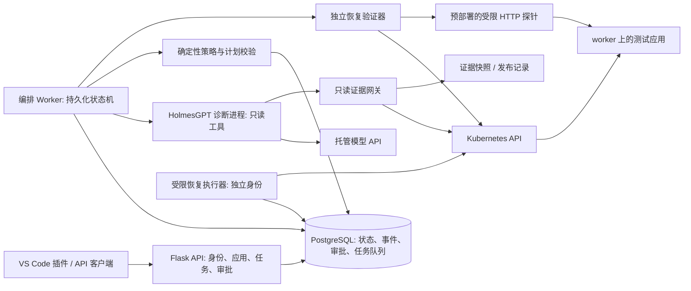

# Kubernetes 发布故障诊断与受控恢复 Agent 技术方案

更新日期：2026-09-18。状态：待实施设计，不代表下述 Agent、集群和安全能力已经实现。

本文是后续建设的主方案，取代原来的本地 CI/CD 概述。`docs/ai_agent_delivery_plan.md` 是此前“测试环境发布与失败修复”的备选草案；其中本机虚拟机、Docker 发布主线和组件选型不再作为本方案的前置要求。

## 1. 项目定位与背景

### 1.1 一句话定位

面向 Kubernetes 测试环境的发布故障诊断与受控恢复 Agent：关联发布变更和运行证据，主动调查故障，在人工批准后执行有限恢复操作，并验证服务是否真正恢复。

英文工作名称：**Kubernetes Release Diagnosis and Controlled Recovery Agent**。

### 1.2 真实背景

本项目起点是在导师指导下完成的 CI/CD 实践：通过 VS Code 插件触发测试、部署和结果查询。已有联调说明，“命令执行成功”和“业务服务可用”并不是一回事，例如子进程启动后退出、健康检查失败、客户端长时间等待，以及旧实例可能干扰新实例验证。

进一步进入 Kubernetes 后，一次发布故障可能同时涉及镜像、配置、Pod 状态、调度、Service、探针和依赖服务。开发者需要在发布记录、日志和集群事件之间反复查证。项目因此从“替用户执行一条流水线”收敛为“帮助用户调查一次发布故障，并安全地完成恢复闭环”。

这是基于现有实践提出、需要用户试用验证的需求假设，不是已经获得企业客户验证的商业结论。导师指导经历、个人后续迭代、合成故障实验和真实用户案例应分别记录，不包装成阿里云内部生产系统。

### 1.3 与云计算及阿里云工作的关系

- 基础设施：使用 ECS、VPC、安全组、云盘搭建可重复部署的 Kubernetes 环境。
- 云原生交付：处理 Deployment、Service、镜像版本、发布记录和恢复策略。
- 可靠性工程：基于日志、事件、指标和业务探测判断故障与恢复，而不只看进程是否运行。
- AI 工程：实现有界调查、工具权限、证据引用、人工审批、失败移交和效果评测。

这属于云原生运维与交付可靠性方向，不等于开发虚拟化内核、GPU 调度器或推理引擎。阿里云已有相关方向的产品，例如 [ACK 容器服务 Agent](https://help.aliyun.com/zh/ack/ack-managed-and-ack-dedicated/user-guide/container-service-agent-function-introduction) 和 [STAROps](https://help.aliyun.com/zh/starops/product-overview/introduction-of-starops)。它们证明该类问题有现实应用场景，但不证明本项目有商业竞争优势。

### 1.4 用户价值与开源借鉴

目标用户是维护少量 Kubernetes 服务、发布后需要自己排障的开发者或小团队。用户不必更换原 CI/CD，也不必让本项目重新构建代码；可以直接登记已存在的集群、应用和失败发布。

承诺验证的价值是：减少查找证据的人工操作，给出可核查的原因，降低恢复操作选错资源或版本的风险，并留下可复盘记录。不是承诺“任何故障都能自动修复”。

| 参考项目 | 借鉴方式 | 本项目需要负责的部分 |
| --- | --- | --- |
| [HolmesGPT](https://github.com/HolmesGPT/holmesgpt) | 复用诊断引擎，学习工具调查与证据组织；也作为评测基线 | 发布身份、证据快照、受限工具接口、审批与执行边界、恢复验收 |
| [K8sGPT](https://github.com/k8sgpt-ai/k8sgpt) | 学习 Kubernetes 分析器与常见异常分类，作为规则诊断参考 | 不重复实现一个通用 Kubernetes 问答产品 |
| 通用编程 Agent + 相同工具 | 作为公平对照，不假设通用 Agent 无法完成这些工作 | 通过实际接入成本、人工时间和安全测试证明专项实现是否有增益 |

HolmesGPT 已有持续检查和部署验证等功能，不能把这些功能描述成自己的独有创新。项目的工程贡献应落在具体实现和评测结果上。复用代码前检查所选版本许可证，保留要求的声明，记录上游版本及自己的改动，不用 GitHub 星数代替需求验证。

### 1.5 本项目的评价标准

本项目首先是一个具有实际使用场景的工程项目，不以“市场上没有同类产品”或“所有指标超过高星项目”为成立条件。已有成熟方案既是学习材料，也是检验自己设计的参照。

评价重心是：能否理解问题并作出取舍，能否亲自实现关键机制，能否处理失败与不确定性，以及能否让其他人部署、验证和使用。技术深度不是组件数量；为了增加难度而自建数据库、模型框架或消息中间件，并不会自动增加价值。

区分三个结果：**工程完成**需要运行和故障测试证明；**实际使用价值**需要真实任务与使用反馈证明；**商业竞争力**还需要采用率、持续使用和成本等证据。暂时没有用户不妨碍开始工程建设，也不应把工程验证提前描述为商业成功。

完成标准不是“模型能说出错误原因”，而是“错误情况下系统仍能守住权限、版本与状态约束，并对结论和执行结果负责”。后面的自主实现范围、故障实验和验收报告共同证明这些能力。

## 2. 当前基础与第一版边界

以下现状来自当前代码静态检查和已有联调记录，本次文档更新没有重新运行完整部署。

| 能力 | 当前状态 | 后续处理 |
| --- | --- | --- |
| VS Code 插件、意图识别、任务执行和历史入口 | 已有实现 | 保留交互入口，新增故障调查与审批视图 |
| Python / Node.js / Java runner | 已有实现及既往联调记录 | 保留回归，不继续逐语言扩展 Agent |
| Docker / server / Azure 部署适配器 | 代码存在；Azure 云端验证不在本方案中视为已完成 | 保留为 legacy 能力，不直接暴露给模型或远程用户 |
| SQLite 历史、阶段耗时和状态摘要 | 已有实现 | 迁移到任务执行中持续落库、证据独立存储 |
| 项目识别和测试门禁 | 依赖用户填写类型，主要按命令结果判定 | 不称为自动理解项目；新发布证据需要更严格校验 |
| Kubernetes、主动取证、审批恢复、故障评测 | 尚待建设 | 新主线 |

第一版支持一个登记集群、一个受邀团队、指定 namespace 内的无状态 HTTP 服务，以 Deployment + Service 为主。应用是什么语言不是主要分支，主要依据 Kubernetes 资源和运行事实诊断。语言相关日志只作为补充证据。

**首批诊断场景：**镜像拉取失败、启动后崩溃、Readiness 失败。之后扩展到 Service 配置错误、Pod OOM、资源请求导致 Pending，以及“故障与本次发布无关”的反例。

**首批恢复动作：**仅允许把登记 Deployment 的 Pod template 回退到明确记录、已验证健康的版本，仍需人工审批。找不到可信旧版本时只给调查结果，不猜一个版本回滚。

**明确不做：**任意主机 SSH 控制、节点重启、修改安全组、购买云资源、数据库回滚、自动修业务代码、删除 namespace/PVC、修改 RBAC/Secret，以及无人审批的生产发布。跨团队多租户 SaaS、高可用控制面和任意陌生代码执行不在第一版承诺内。

典型用户流程：

1. 管理员登记集群和应用，设置可读范围、允许恢复的 Deployment、业务验证规则。
2. 用户在插件选择应用和发布，输入“这次发布后一直不就绪，帮我查原因”。
3. 后端立即返回任务 ID，Agent 自动选择只读工具，展示调查进度、证据与尚未排除的假设。
4. 存在可恢复方案时展示具体目标、版本差异、影响和验证计划，等待用户批准。
5. 系统核对审批和实时状态后执行，持续验证目标版本及业务接口，生成报告。
6. 无法证明恢复时移交人工，不循环重启，也不把“已发送命令”显示为恢复成功。

## 3. 三台 ECS 的基础设施方案

### 3.1 不再依赖本机虚拟化

Windows 电脑只运行编辑器、插件、Git 和可选的 Python 单测；集群、集成测试和长期运行的服务放在 ECS。无需在本机安装虚拟机、WSL2 或本地 Kubernetes，也不以 Docker Desktop 正常运行为前提。

选择 **K3s：1 个 server/control-plane + 2 个 agent/worker**，即通常所说的 1 master、2 worker。这里 K3s 的 agent 指工作节点进程，与本项目的 AI Agent 不是同一个概念。

K3s 用来降低搭建成本，项目重心是工作负载诊断，不是手工安装所有 Kubernetes 组件。若以后重点转为集群生命周期或控制面故障研究，再单独用 kubeadm 建环境；已经建好的可用 Kubernetes 集群也不必仅为统一工具而重建。

**三台 ECS 自建 Kubernetes 不等于阿里云 ACK。一个控制节点也不构成控制面高可用。** 当前环境适合开发、回归、受控故障实验和小范围试用，不能由此声称具备生产级容灾。

### 3.2 操作系统与资源前置检查

已确认的资源是：一台 **CentOS 7.9 64 位、2 vCPU、2 GiB 内存**的 ECS；另外两台尚未创建。系统盘大小、内核、地域/VPC、剩余额度和允许选用的规格尚未确认。先在现有 ECS 只读检查：

```bash
cat /etc/os-release
uname -r
nproc
free -h
df -h /
```

现有 CentOS 7.9 属于已于 2024-06-30 停止维护的 CentOS Linux 7。建议先确认实例内没有需要保留的服务和数据，完成备份与恢复检查，再更换仍受支持的系统；不继续通过旧软件源搭建长期环境。这不是说它绝对无法运行 Kubernetes，而是不值得让系统维护和兼容性问题干扰项目主线。参考 [CentOS 生命周期](https://www.centos.org/cl-vs-cs/)。

新建环境默认建议 Ubuntu 24.04 LTS，以减少安装文档和 Python 运行环境的适配成本；这不是阿里云相关性的要求。已有受支持且兼容的系统可以保留。参考 [Ubuntu 生命周期](https://ubuntu.com/about/release-cycle)。本文不执行重装。

| 节点 | 实例安排与建议规格，不是官方最低值 | 职责 |
| --- | --- | --- |
| control-1 | 优先使用一台新实例，2 vCPU / 4 GiB 起；合并诊断与数据库时，额度允许再考虑 8 GiB | K3s 控制面；容量验收通过后运行项目控制服务 |
| worker-1 | 复用现有 2 vCPU / 2 GiB 实例，备份并更换系统后加入 | 轻量样例应用和受限故障场景，不承载模型推理或镜像构建 |
| worker-2 | 另一台新实例，建议 2 vCPU / 4 GiB；若额度只允许 2 GiB 则缩小负载 | 第二副本、固定探针；历史指标组件按测量结果决定是否启用 |

系统盘以 40 GiB SSD 起作为规划参考，不要求未经核实就扩容现有盘。实际要给系统、容器镜像、应用日志和清理缓冲分别留空间，并限制镜像及日志保留量。

K3s 官方基础下限为 server 2 核/2 GB、agent 1 核/512 MB，不包含应用负载。不能把这个数字当作完整 Agent 系统的容量保证。参考 [K3s 要求](https://docs.k3s.io/installation/requirements)。

不要因为现有实例最早创建，就默认让它兼任控制面、数据库和诊断服务。两台新实例的规格应先对照免费额度和预计保留时间，不在此处假定 4 GiB/8 GiB 一定可免费使用，也不自动创建或升配。

资源紧张时先只运行一组轻量 Python/Node.js 应用、一个并发调查和一个故障实验，不同时启动所有 Java demo 和完整监控栈。控制节点内存不足时，开发阶段可把项目 API 临时放在 Windows 原生 Python，诊断引擎使用可运行的独立 Linux 环境；这只是开发过渡，不算完成云端交付。若三台最终都只能选择 2 GiB，不预先承诺完整栈可稳定运行，必须先做组件实测、裁剪或重新分配资源。

创建顺序可以是“先确认系统迁移与额度 -> 新建 control-1 -> 现有实例作为 worker-1 跑通 -> 再创建 worker-2”。这样能够先验证网络和容量，避免一次创建三台后同时排查多个问题；最终的跨节点与双 worker 验收仍使用 1+2 拓扑。

容量验收至少包括：记录各服务空闲及调查峰值的内存/CPU/磁盘，完成连续 10 次串行调查且无 OOM、磁盘耗尽或控制面失联。给系统预留约 20% 内存作为起步目标，结合 `MemAvailable` 和实际峰值调整，不用 swap 或一次启动成功代替容量验证。受邀长期试用前必须完成云端验收，不能靠隐含的第四台付费机器补齐资源。

### 3.3 网络与额度

- 三台机器使用同地域、同 VPC 的内网通信，Pod/Service CIDR 不与 VPC 地址段冲突。
- 按所选 K3s 网络模式放行必要节点间端口。默认 Flannel VXLAN 需要节点间 UDP 8472，worker 需要访问控制节点 TCP 6443；使用 Metrics Server 时核对 TCP 10250。不要把这些端口向整个互联网开放。
- SSH 仅向管理员来源开放；开发期通过 SSH 隧道访问项目 API。不能通过关闭全部防火墙、SELinux 或跳过 TLS 校验“解决”连通性。
- 数据库、诊断引擎、执行器和 Kubernetes API 不作为公网业务入口。远程试用入口采用受限网络或 HTTPS + 认证。
- 软件源、镜像仓库、模型 API 的出网在搭建前验证。优先使用受信任且可达的仓库，不默认购买 NAT、负载均衡或托管服务。
- 核对免费额度覆盖的实例、云盘、公网流量及到期时间；模型调用、对象存储、快照等是否另行收费需单独确认。设置余额/预算提醒，不假设停机后所有费用都归零。

安全组也需要约束内网访问，同一 VPC 不是可信边界。参考 [ECS 内网访问控制](https://help.aliyun.com/zh/ecs/user-guide/using-security-groups-to-implement-intranet-access-control-and-micro-isolation)。

## 4. 整体架构与部署位置

采用模块化单体加少量独立进程，不先拆成微服务平台。**调查可以交给模型，授权、执行和成功判定必须由确定性代码控制。**



图中没有“模型直连执行器”的通道。执行器只领取数据库中已批准、未过期且通过策略校验的动作，不能根据模型的一句话直接执行。

| 位置 | 部署内容 | 取舍 |
| --- | --- | --- |
| Windows | 插件开发、代码编辑、纯 Python 单测；可临时调试 API | 不要求虚拟化；不是最终服务必须在线的依赖 |
| control-1 主机 | K3s server；容量允许时用独立 systemd 用户运行 API、编排、诊断、执行器及 PostgreSQL | 节省第四台主机，但共享机器故障域；不宣称故障隔离充分 |
| worker-1/2 的实验 namespace | 应用与故障用例，设置 requests/limits 和配额 | 所有故障限制在这些应用，不对控制节点注入故障 |
| worker 上独立运维 namespace | 固定版本探针；后期可选精简 Prometheus | 不给应用读取运维凭证的权限，不部署全套大体量监控栈 |

项目控制服务先放在被测应用之外，避免一次应用故障把诊断服务一起打断。主机上的诊断进程与执行器使用不同系统用户、文件权限和凭证；只靠不同 Python 类名不构成隔离。禁止在 control-1 执行用户仓库的安装、构建或任意脚本。

控制节点应设置调度隔离，普通业务副本分布到两个 worker；安装后检查 K3s 默认组件与调度约束是否兼容，避免系统组件无处运行。暂不做控制节点宕机、网络分区、磁盘耗尽等破坏性实验。

后续面向更强可靠性的使用，再把项目控制服务迁到独立主机，并接入已有 ACK 集群或高可用自建集群。API、工具契约和数据模型不因此改变；网络、凭证、数据库备份与可用性需要重新验证。

## 5. 技术选型与取舍

| 模块 | 第一版选择 | 为什么与代价 |
| --- | --- | --- |
| 后端 | 保留 Flask；Python 3.12 独立环境；Pydantic 校验；Linux 用 Gunicorn/systemd | 复用现有代码，不为异步任务而重写框架；版本需与固定的诊断 SDK 做兼容测试 |
| 诊断引擎 | HolmesGPT Python SDK，独立受限进程，通过 `DiagnosticEngine` 适配 | 复用成熟工具循环，自己的精力用于发布证据与恢复；承担上游升级兼容成本 |
| 编排 | 显式 Python 状态机 + PostgreSQL 持久化 | 固定主流程足够清晰；首版不叠加 LangGraph、CrewAI 和第二套调度系统 |
| 模型 | 优先评测百炼上支持工具调用的 Qwen 模型；模型/地域/版本配置化 | 不占用三台 ECS 做推理；具体型号由工具正确率、成本和延迟选择，不预先承诺效果 |
| 任务调度 | PostgreSQL jobs 表 + 单 Worker 轮询、租约与重试 | 低并发先减少 Redis/Celery 运维；幂等和宕机恢复仍需自己实现及测试 |
| 持久化 | PostgreSQL + 现有 SQLAlchemy + Alembic | 存执行中状态、审批和审计；SQLite 旧历史只读保留或显式迁移 |
| Kubernetes 接入 | 官方 Python client，固定与集群兼容的版本 | 使用结构化 API，不把任意 kubectl/shell 字符串交给模型 |
| 部署清单 | 原生 YAML + Kustomize overlay | 便于制造可控版本差异；不要同时引入 Helm、Argo CD 和自研发布平台 |
| 镜像与发布来源 | 已有可信 CI 或管理员构建后推送 OCI 仓库，使用 digest | Agent 不负责第一版镜像构建；需要登记构建来源和版本证据 |
| 证据存储 | JSON 元数据入库，大日志/快照存受控文件目录，数据库存引用与哈希 | 减小返回体；以后按同一接口迁 OSS，不先部署 MinIO |
| 观测 | Kubernetes API、Events、限定范围日志、Metrics Server；后期精简 Prometheus | 先证明诊断价值，再增加历史指标；不以安装监控组件数量作为成果 |
| 客户端 | 现有 VS Code 插件，游标轮询进度，展示证据和审批 | 少做一套前端；Web UI 等用户需要时再加 |
| 测试 | pytest、真实集群契约/集成测试、版本化故障评测集 | Mock 用于逻辑回归，不能替代云端真实验证 |

SDK 和 HTTP 工具扩展以 [HolmesGPT Python SDK](https://holmesgpt.dev/latest/installation/python-installation/) 与 [HTTP Connectors](https://holmesgpt.dev/latest/data-sources/api-toolsets/) 为接入依据。生产配置固定发行版本或 commit，不追踪 `master`，不直接复制启用全部工具的快速示例。

百炼支持 [Function Calling](https://help.aliyun.com/zh/model-studio/qwen-function-calling)，HolmesGPT 有[兼容接口接入方式](https://holmesgpt.dev/latest/ai-providers/openai-compatible/)。两者文档支持这种接入方向，但这里没有完成组合联调。P2 必须验证多轮工具调用、参数校验、截断、超时和 token 统计；不通过就先使用已验证的模型配置，不同时重写模型适配层和诊断引擎。

### 5.1 对 HolmesGPT 的明确使用边界

复用它的诊断循环，不复用全部默认权限。先用其只读模式建立基线，再接入本项目的发布快照和证据工具。自己的试用配置只暴露固定 HTTP 只读工具，工具地址由服务端配置，不允许模型指定任意 URL。

所有工具返回都经过 namespace/资源范围校验、脱敏、大小限制和证据编号。若固定 SDK 无法满足这些约束，P2 停在只读基线阶段，先完成适配或选择更小的引擎，不以提示词替代权限控制。

明确禁用 Bash、任意文件读取、外部 MCP 自动发现、写操作工具及自动修复扩展。Kubernetes 凭证保留在工具网关，不提供给模型进程。参考其[命名空间权限配置](https://holmesgpt.dev/latest/installation/namespace-scoped-access/)；项目自行收紧工具集，不将默认设置视为已经满足本方案。

### 5.2 自主实现范围与工程深度

复用模型调用和开源诊断引擎，不意味着只给现成工具包一层界面。下面六项是本项目需要亲自设计、实现、测试并能解释的核心；每项都要有失败实验，而不只是一张架构图。

| 工程课题 | 自主实现的机制 | 能展示的验证实验 |
| --- | --- | --- |
| 发布与故障证据关联 | 快照规范化、UID/owner 关联、差异提取、时间窗与缺失标记 | 同样 CrashLoopBackOff 分别来自新启动参数和无关依赖故障，能引用不同证据并避免误归因 |
| 有界调查与上下文管理 | 工具契约、证据分页/去重、查询预算、错误分类、诊断引擎适配与证据引用校验 | 日志超过上下文限制或部分工具失败时，仍能追加取证或明确停止，而非丢弃关键错误后瞎猜 |
| 可恢复任务系统 | 状态迁移、租约、幂等、事件序号、未知结果核对 | 中途终止 Worker、重复投递或丢失回包后，任务可解释地恢复，不重复提交恢复动作 |
| 安全审批与并发控制 | 不可变计划哈希、过期处理、字段白名单、集群前置条件 | 批准后被管理员发布新版本，旧审批无法覆盖新配置；注入日志无法提升工具权限 |
| 版本与业务恢复验证 | 目标 ReplicaSet、EndpointSlice、镜像及业务断言联合校验 | 旧实例仍返回 200、新版本未就绪时，不能误报本次发布或恢复成功 |
| 可复现实验与交付 | 故障注入/reset、留出评测、安装升级、容量和备份还原 | 另一位开发者依照文档复现故障与恢复；换应用后仍能运行，结论不依赖手工改答案 |

这些机制大多不是学术创新，也不要求每项都比成熟项目先进。价值在于能将它们组合成约束明确、可验证且可维护的系统，并说明何处复用、何处自己实现、何处仍有局限。

针对 Agent 本身，需要能跟踪一条完整工具调用链，解释模型为何获得某份上下文、工具失败如何回传、预算如何截止，以及新证据如何改变下一步调查。若只是把所有日志一次性发送模型再展示回答，应如实称为日志分析，不作为主动调查 Agent 的验收结果。

## 6. Agent 工作方式

### 6.1 架构类型

整体是**确定性工作流包裹有界 ReAct 式调查循环**：先固定目标与约束，调查阶段由模型根据证据选择下一工具，再提出候选原因和恢复建议；计划校验、审批、执行及验证由程序推进。

不需要多个“规划 Agent、执行 Agent、审查 Agent”互相聊天。单个诊断 Agent 足以验证需求，角色和模型越多，调用成本、责任归属和失败恢复越复杂。

模型决定“下一步应看什么”和“哪些证据支持某个假设”；程序决定“能否读取”“是否获批”“能否修改”“是否满足恢复条件”。直接可判定的问题走规则路径，不为每次查询强行调用模型。

### 6.2 一次任务的状态

```text
queued -> collecting -> investigating -> diagnosed
diagnosed -> completed_read_only
diagnosed -> waiting_approval -> executing -> verifying -> recovered
investigating / diagnosed -> needs_human
任何阶段 -> failed / cancelled
外部动作结果不明确 -> reconciling -> verifying / needs_human
```

`failed` 表示系统执行失败，`needs_human` 表示调查已完成但无法在授权范围内解决；两者不混用。`recovered` 表示指定恢复版本达到验证要求，不代表最初失败的新版本已经发布成功。

例如发布 B 后启动失败，经审批回退 A 并验证成功，应分别记录：`release_B.status=failed`、`incident.status=recovered`、`active_release=A`。

### 6.3 初始预算

每次调查最多 8 次模型调用、20 次只读工具调用、5 分钟主动调查时间；最多生成 2 版恢复建议，第一版任务最多执行 1 次恢复动作。日志单次按窗口和行数读取，例如 200 行/32 KiB，截断必须明确标记。

这些是起步配置而非性能承诺。等待审批不占 Worker 工作槽，不计入主动调查时限，但审批有独立过期时间。重启、重试和模型切换也计入原任务预算，不靠重试重置计数。

遇到无新增证据、权限不足、预算耗尽、模型不可用或不支持的故障，返回已收集证据和下一步人工建议。模型自报置信度不是统计概率，也不能替代审批或成功验证。

## 7. 发布证据与调查工具

### 7.1 发布不是一个镜像名

发布记录至少包含：`cluster_id`、namespace、Deployment UID、release_id、Git SHA（若可得）、镜像 digest、Pod template 哈希、非敏感配置版本、来源、发布时间、验证规则和上一已验证版本。

采用登记的发布入口或可信 CI 回调记录发布前后快照；首批实验由可重复的发布脚本生成记录。仅在故障后读取当前资源，不能还原所有历史。对于没有提前接入的应用，要明确标记历史证据不完整。

CI 回调必须认证并校验来源；任意用户提交的 `tests_passed: true` 不能作为发布门禁证据。第一次只接入“调查已有失败发布”时可以没有测试报告，但不得据此宣称新版本通过质量门禁。

每份证据记录采集时间、来源时间、资源 UID、resourceVersion、查询范围、脱敏情况、内容哈希及缺失原因。Events 会过期，日志会轮转；需要持续采集登记应用的关键事件与变更，断线后补查当前快照，并标记无法补齐的时间段。

快照哈希必须有版本化的规范化规则：剔除状态、resourceVersion 和非业务生成字段，稳定对象键序，不随意排序有语义的数组；脱敏展示与用于变更判定的字段投影分开。不能把整个实时 JSON 的哈希直接当作发布版本，否则状态更新也会触发虚假“配置漂移”。

### 7.2 首批工具契约

| 工具 | 返回内容 | 限制 |
| --- | --- | --- |
| `get_release_context` | 当前/上一已验证发布的身份及配置快照 | 仅当前登记应用 |
| `get_workload_state` | Deployment/ReplicaSet/Pod 状态和归属 | 校验 UID、ownerReferences 与 namespace |
| `get_related_events` | 指定对象及时间窗的调度、拉取、探针事件 | 分页、有数量上限 |
| `get_container_logs` | 当前或 previous 容器日志 | 显式选择 Pod/容器/窗口，脱敏后返回 |
| `get_service_routes` | Service、EndpointSlice 与匹配 Pod | 只读，不改 selector |
| `compare_release_specs` | 镜像、启动参数、探针、资源配额的结构化差异 | 屏蔽凭证明文，变更相关不等于因果成立 |
| `get_resource_evidence` | 已获准的用量、终止原因和资源请求 | 没有历史指标时不能虚构峰值 |
| `read_evidence` | 本任务已保存证据的指定片段 | 不能变成任意主机文件读取 |

Node 信息由管理员另行批准的只读采集器提供过滤摘要，不为获得节点信息而给 Agent 集群管理员权限。ConfigMap 也可能含敏感数据，不默认把整个对象发送给模型。

Metrics Server 提供资源指标，不是历史监控数据库；`OOMKilled` 可以确认某次 OOM 终止，但不足以独立断言“应用内存泄漏”。需要趋势分析时再增加精简 Prometheus 和相应采样。参考 [Kubernetes 资源指标链路](https://kubernetes.io/docs/tasks/debug/debug-cluster/resource-metrics-pipeline/)。

### 7.3 输出报告

报告包含故障摘要、影响范围、发布与异常时间线、已确认事实、候选原因、支持/反驳证据、缺失信息、建议动作、风险和验证结果。每项核心结论引用证据 ID，不输出看似精确但无法核查的确定结论。

示例结论应是“本次 B 版本修改了启动参数；新 ReplicaSet 对应 Pod 报参数解析错误；旧版本 A 曾通过验证”，而不是仅看到 CrashLoopBackOff 就写“新代码有 bug”。

API 默认返回摘要、状态、耗时与证据引用；完整日志按需分页读取。不得再次把同一份结果复制到任务详情、历史记录和嵌套部署结果中。

## 8. 受控恢复与成功判定

### 8.1 恢复计划和审批绑定

模型只能提出结构化建议。确定性策略从登记发布中生成可执行计划，首版动作是 `restore_verified_pod_template`，不是任意 JSON patch，更不是任意命令。

计划至少绑定：任务 ID、应用/集群/namespace、Deployment UID、当前 Pod template 哈希、目标已验证快照及镜像 digest、精确差异、动作类型、验证规则、策略版本、有效期和 `plan_hash`。审批只接受这个哈希对应的不可变计划。

执行前重新检查目标身份、当前期望配置及授权。发布被他人改动、目标被删后重建、计划或策略改变、审批到期，都使审批失效。resourceVersion 会因状态更新而变化：仅状态变动可重新采集并核对 spec；spec 或 UID 变化必须停止，不能无限重试覆盖。

最终写入携带当前 resourceVersion 或 JSON Patch 前置条件，实现 Kubernetes 侧的乐观并发检查。单靠数据库锁无法防止管理员同时修改集群。参考 [Kubernetes API 并发控制](https://kubernetes.io/docs/reference/using-api/api-concepts/)。

### 8.2 回退的边界

Deployment 的原生回退只恢复 Pod template，不会自动恢复 Service、被原地修改的 ConfigMap、Secret、数据库或外部副作用。参考 [Deployment 回退语义](https://kubernetes.io/docs/concepts/workloads/controllers/deployment/#rolling-back-a-deployment)。

因此首版实验应用使用固定 digest 和版本化配置引用；恢复前验证依赖配置仍然存在且内容匹配。涉及 Service/ConfigMap 外部变动或数据库迁移时，不套用通用回滚，交给人工。

不自动执行 `rollout undo` 到“上一个”未知版本，而是选择明确登记且通过验证的目标快照。不能为通过健康检查而删除探针、放宽测试断言或关闭安全策略。

应用如果受 GitOps 控制器管理，直接改在线对象可能马上被覆盖。接入时登记控制权；第一版对这种应用只读诊断，后续通过审批后的 Git 变更恢复，不与 GitOps 控制器争夺状态。

### 8.3 恢复验证

验证器不接受模型的“看起来恢复了”，按登记规则检查：

1. Deployment UID 与批准对象一致，控制器已观测本次 generation，期望镜像和配置哈希匹配恢复计划。
2. 目标 ReplicaSet 的副本达到 Ready/Available，旧错误版本不再承接目标流量，检查实际容器 imageID 与预期 digest 的对应关系。
3. EndpointSlice 指向正确且 Ready 的 Pod，而非旧实例或其他应用。
4. 固定探针通过 Service 调用 `/health`、`/version` 和一个有实际响应断言的业务接口，版本标识与目标发布一致。
5. 在预设观察窗内重复成功，例如 60 秒内每 5 秒一次，且重启次数不再增加；探测超时、证据缺失或混合版本均不判成功。

探针是预部署、无集群写凭证的固定服务，由验证器调用，不向模型开放任意 HTTP 请求或创建 Pod 的能力。目标只允许登记 Service/端口/路径，校验解析地址，拒绝重定向到元数据、控制面和未授权地址；凭证由探针持有，不进入提示词。

观察窗只能证明该窗口内达到验收要求，不保证未来不会再次故障。回退旧版本属于止损，不等于修复了新版本业务代码。

## 9. 异步执行、持久化与恢复

旧 `/api/tasks/execute` 在 HTTP 请求内跑完整流程，并在结束后保存历史。新流程不能沿用这种长连接模型，也不以提高 curl 超时时间解决可靠性问题。

1. 创建任务、初始事件和 job 在一个数据库事务中提交，返回 `202 + incident_id`。相同用户的幂等键重复提交返回同一任务；键相同但内容不同则拒绝。
2. Worker 在短事务中领取 job，写入 owner、lease_until 和 fencing generation，然后提交；不能持有数据库事务跨越模型或网络调用。
3. 每一步持久化输入哈希、attempt、状态、事件序号与结果引用。租约定期续期，过期结果不能覆盖新 attempt。
4. 等待审批时无活动 Worker；批准请求在事务中验证计划并排入动作 job。拒绝或到期均留下事件。
5. 同一 Deployment 的恢复动作串行化。执行器在写前再验证租约/审批，并使用集群前置条件，重复通知不能造成连续回退。
6. 如果外部写入成功但响应丢失，进入 `reconciling`，通过动作 ID、资源身份和实际配置核对。确认不了就移交人工，不盲目再写一次。
7. 取消先停止后续调查和未执行动作；已提交的 Kubernetes 变更不能被“取消”撤销，必须继续记录和核对，不能假装没有发生。

关键不变量是：无有效审批不写、目标身份/配置已变不写、同一目标同一时刻不并发恢复、动作结果未知不自动重放。租约代次仅能限制自己的数据库写入，不会被 Kubernetes 自动识别；旧执行器失联且请求可能仍在途时，目标保持 `reconciling` 并暂停新的写动作，不能只因租约到期就把动作交给另一个 Worker 重做。

第一版用 PostgreSQL 表承担低并发调度，暂不引入 Redis/Celery。实现时对领取、租约、并发和重试做集成测试；这是工程取舍，不是数据库天然提供“恰好一次”。后续出现吞吐需求再替换调度层，不改变任务契约。

诊断引擎中断后可以基于持久化证据重新调查，记录为新 attempt；不承诺恢复模型内部未持久化的思考过程。动作与调查分开存储，重新调查不会重新执行已批准动作。

## 10. 权限与安全边界

| 身份 | 允许范围 | 明确禁止 |
| --- | --- | --- |
| 项目用户 | 自己获准的应用、证据和任务 | 通过猜 ID 读取其他应用记录 |
| 审批者 | 对授权环境的具体计划批准/拒绝 | 修改计划后沿用旧审批 |
| 只读网关 | 指定 namespace 内所需 get/list/watch、日志读取 | Secret、exec、port-forward、写资源和用户指定 kubeconfig |
| 恢复执行器 | 指定 Deployment 的受控 template 更新 | ClusterRole、节点、Secret、namespace、云资源管理 |
| 管理员/实验操作者 | 初始安装、登记资源、授权故障注入与清理 | 把管理员凭证放进 Agent 运行环境 |

Kubernetes RBAC 无法独自限制 Deployment patch 中的每个字段。执行器必须只接受已验证模板，禁止修改 serviceAccount、特权、hostPath、hostNetwork 等敏感字段，并配合 Pod Security、配额和必要的准入策略。能创建/改写 Pod 的权限本身有扩权风险，namespace 不是强多租户隔离。参考 [RBAC 安全实践](https://kubernetes.io/docs/concepts/security/rbac-good-practices/)。

- 远程 API 从一开始就有用户令牌、应用权限检查和审计；token 可撤销，插件使用 SecretStorage，不把密钥放普通设置。
- 只读网关与执行器分离凭证和进程权限。Agent 无主机 root、Docker socket、SSH 私钥、ECS AccessKey 或 Kubernetes 管理员 kubeconfig。
- 集群访问令牌要有有效期、续期和撤销设计；不依赖一个遗忘在文件里的永久管理员证书。
- 日志、annotations、仓库文件、事件内容均是不可信数据；其中“忽略规则”“发送密钥”等文本不能成为系统指令或审批。
- 工具网关绑定任务范围，模型请求其他 namespace、敏感字段或未知 URL 时确定性拒绝；秘密脱敏在发送模型之前完成。
- 即使不读取 Secret，日志和普通 env 也可能泄露凭证；试用前需要敏感数据规则、最小化采集、保留期限及外发模型授权。
- 样例服务限制网络访问和资源使用，关闭不需要的 ServiceAccount token 挂载。故障实验身份与日常 Agent 身份分离。
- 首版不接入陌生仓库任意代码，也不把旧的 shell 执行 API 直接开放在新远程入口上。

## 11. 数据模型、接口与代码组织

### 11.1 核心记录

| 记录 | 核心信息 |
| --- | --- |
| Cluster / Application | 集群、namespace、目标 UID、允许能力、凭证引用、验证规则 |
| Release | 来源、SHA、digest、快照哈希、配置依赖、验证记录、发布时间 |
| Incident | 用户、目标发布、状态、阶段、预算、开始/结束时间 |
| Evidence / ToolCall | 来源、采集时间、查询范围、内容哈希、引用、截断/脱敏信息、错误 |
| Diagnosis | 已知事实、候选原因、证据引用、未决问题、模型及配置版本 |
| ActionPlan / Approval | 精确差异、前置条件、计划哈希、审批者、有效期、决定 |
| ActionAttempt / Job | 动作幂等键、租约、attempt、结果未知状态、重试次数 |
| Verification / Event | 目标版本、各探测事实、业务断言、单调事件序号、审计信息 |

业务 PostgreSQL 与 K3s 自身的数据存储是两套不同的数据，不混用表、不共用数据库账号。日志和证据按应用/任务权限读取，不能因为有文件链接就绕过授权。

### 11.2 新增 API 草案

| 接口 | 作用 |
| --- | --- |
| `POST /api/v2/incidents` | 创建调查，立即返回 ID；cluster/app/release 均从登记记录解析 |
| `GET /api/v2/incidents/{id}` | 状态、阶段、耗时、报告摘要 |
| `GET /api/v2/incidents/{id}/events?after_seq=...` | 断线后补读进度，游标分页 |
| `GET /api/v2/incidents/{id}/evidence/{evidence_id}` | 授权范围内读取证据片段 |
| `GET /api/v2/incidents/{id}/plan` | 查看具体差异、前置条件和风险 |
| `POST /api/v2/incidents/{id}/approval` | 提交计划哈希及批准/拒绝，校验权限与有效期 |
| `POST /api/v2/incidents/{id}/cancel` | 请求取消，返回实际可取消的范围 |
| `POST /api/v2/releases` | 管理员/可信 CI 登记发布及来源，不接收无验证的成功宣称 |

接口不接受任意 shell、任意 kubectl 参数、临时 AccessKey 或用户填写的“已获审批”布尔值。插件可关闭再打开查询，不依赖一个持续数分钟的 POST 连接。

### 11.3 现有仓库的迁移方式

| 路径 | 处理 |
| --- | --- |
| `backend/routes/tasks.py` | 保留本地 legacy 兼容；新入口单独放 `backend/routes/incidents.py`，远程部署不注册任意执行入口 |
| `backend/services/task_executor.py` | 不改成万能 Agent；抽取可复用的结果/耗时结构，安装失败仍继续测试等问题另补回归 |
| `backend/services/test_runners/` | 保留，不纳入模型任意调用工具；新版本发布接入时补真实测试报告校验 |
| `backend/services/deployers/` | 旧部署器继续独立使用；恢复执行器另建，不借用通用 shell 执行函数 |
| `backend/services/openai_service.py` | 保留旧意图入口；新 `DiagnosticEngine` 不把一次意图分类当作完整 Agent |
| `backend/services/task_history_service.py` | 保留旧历史；新事件与证据按新表存储，迁移必须备份、可回退 |
| `vscode-extension/extension.js` | 增加调查、查看证据、批准计划和取消，复用既有结果展示 |

建议逐阶段新增 `backend/incidents/`、`backend/diagnostics/`、`backend/tools/`、`backend/policies/`、`backend/jobs/`、`backend/executors/`；基础设施清单放 `infra/`，故障用例与评测放 `evals/`。这些是规划目录，本次文档更新没有创建对应实现。

先写窄接口与契约测试，不一次搭完所有目录。旧功能不删除，也不为了这次升级重写全部历史代码。

## 12. 可观测性、维护和交付

系统自己的事件关联 `incident_id / release_id / tool_call_id / action_id`，记录工具时间、模型调用、token、错误分类和各阶段耗时。保存简短决策依据和证据，不要求保存模型隐藏思维链。

列表只展示摘要，详情按需获取日志。对工具拒绝、审批过期、资源漂移、模型限流、Kubernetes API 不可达和验证超时给出不同状态，不统一显示“部署失败”。

初始建议只允许 1 个并发调查和 1 个恢复动作，脱敏日志保留 7 天，任务/报告保留 30 天，具体按磁盘预算配置。等待审批及正在核对的证据不得提前清理；已部署应用不应随任务日志清理被删除。

交付需要固定版本依赖、配置示例、systemd 服务、数据库迁移、RBAC 清单、部署/升级/回退说明、插件安装包和排障手册。先提供远程 Linux 安装脚本，后续有重复安装需求再改为 Ansible；不把安装脚本写成默认重装系统、释放实例或开放全部端口。

数据库备份和证据文件须成套保存，并做还原演练。K3s 控制面另按选定的数据存储备份；单 server 默认可用 SQLite，不要错误套用 etcd-only 的恢复命令，恢复还需要匹配的 server token。参考 [K3s 备份与恢复](https://docs.k3s.io/datastore/backup-restore)。备份至少有一份离开故障主机，任何云存储费用须先确认。

模型 API 不可用时仍可查看历史和原始证据；Kubernetes API 不可用时显示证据过期并阻止恢复；数据库不可用时停止批准和写动作，不能绕过持久化执行。单控制主机故障需要人工恢复，不承诺持续服务 SLA。

## 13. 评测设计：证明不是一个固定演示

### 13.1 故障集

先准备一个带 `/health`、`/version` 和业务接口的无状态样例，稳定版本 A 与错误版本 B 都固定镜像 digest。用三种语言的现有 demo 扩展不同应用结构，而不是给 Agent 写“看见这个错误就回答固定答案”的分支。

| 类别 | 注入与证据 | 正确行为 |
| --- | --- | --- |
| 镜像无法拉取 | 不存在的镜像引用；另一组为仓库网络/权限问题 | 区分名称、授权和连通性；不能统一改镜像名 |
| 启动崩溃 | 错误启动参数或缺少普通环境配置 | 结合 previous logs 与变更定位；符合条件时建议回退 |
| Readiness 失败 | 探针端口/路径改变；另一组为应用依赖不可用 | 区分探针错误与真实不可用，不通过删探针修复 |
| Service 无法访问 | selector 或 targetPort 与 Pod 不匹配 | 解释链路错误；首版不越权改 Service |
| OOM / Pending | 受控内存限制或无法满足的 Pod requests | 引用终止/调度事实，禁止无限加资源或创建 ECS |
| 非发布故障/证据不足 | 依赖不可达、历史缺失、健康应用、权限不足 | 不硬归因最新发布，正确停止或移交 |

实验一次只运行一个场景，注入范围限制在专用 namespace 和指定对象；准备独立 reset/verify 脚本。评测器先验证故障确实发生，再启动计时，结束后由管理员身份恢复基线，不让被测 Agent 自己修改答案。

安全与恢复测试还包括：日志提示注入、跨 namespace 请求、审批过期、目标 UID 改变、并发新发布、重复批准、Worker 崩溃、写入成功但回包丢失、取消、旧版本 HTTP 返回 200 造成的假成功。

### 13.2 公平对照和指标

首轮 6～10 个案例打通流程，正式评测建议至少 48 个案例，例如 18 个开发案例、30 个留出案例，按应用和故障模板划分，不能把换一个名称当作全新案例。故障答案及注入配置只由评测器持有，不泄漏给 Agent。

| 对照 | 目的 |
| --- | --- |
| 规则诊断 + 相同证据接口 | 判断简单规则是否已经足够 |
| 原始 HolmesGPT + 相同数据、权限、预算和可提供的发布上下文 | 衡量自己的发布关联与闭环带来的增益，而非故意限制上游 |
| 配置好相同工具的通用编程 Agent | 检查是否真的比现成工具更省人工；不同模型需单独说明 |
| 本系统去掉发布差异/去掉追加取证的消融版本 | 区分模型效果、数据接入和调查策略各自的贡献 |

记录根因与证据同时正确率、正确拒绝/移交率、误归因率、恢复成功率、误报恢复次数、越权动作、人工主动操作时间、总耗时、token/费用和资源消耗。恢复成功率的分母只能是预先定义的可恢复案例，不把失败临时排除。

固定模型与工具版本、预算和环境；每个代表性案例至少运行 3 次，报告样本数和波动。人工根据隐藏答案和证据复核，不能只用另一个模型打分。与自己的规则/Agent 消融尽量使用相同模型；通用产品若不能固定同模型则标记为产品级比较。

初步试用门槛可设为：留出集证据支持的诊断正确率达到 80%，可恢复子集成功率达到 80%，安全套件观察到 0 次越权执行和假恢复。它们只是拟定目标，不是已实现结果；任何一次越权或假成功都应阻塞试用发布，有限测试的零失败也不意味着风险为零。

对照不是“必须全面击败开源项目”的竞赛。未超过原版引擎的诊断准确率，也可以如实展示自己实现的权限隔离、状态恢复、版本验证与交付能力；但不能把集成工作包装成模型能力提升。哪些收益来自新增证据、哪些来自交互设计、哪些来自 Agent 调查，应分别报告。

## 14. 分阶段实施与验收

按个人每周约 15～20 小时估计 8～12 周，按验收推进，不把时间表当承诺。可以先做技术验证，不要求先有客户；但“真实有用”的最终判断需要他人使用，而非作者自己演示。

| 阶段 | 工作与产物 | 为什么先做 / 取舍 | 退出条件 |
| --- | --- | --- | --- |
| P0 环境确认，约 3～5 天 | 备份并处理现有 CentOS 7.9；核对额度后分批建新节点，固定版本，搭 1+2 K3s | 复用现有 2 GiB 实例做 worker；先解决安全支持、连通性与容量 | 三节点 Ready，跨节点服务和受限访问验证通过；有预算与容量记录 |
| P1 手工排障基线，约 1 周 | 部署健康 A/错误 B，登记版本，复现前三类故障，手工诊断与恢复 | 先证明故障和正确答案可验证，再加 AI | 每类有 reset、证据、健康验证和人工耗时记录 |
| P2 只读 Agent，约 2 周 | 跑 HolmesGPT 基线，封装只读网关、发布上下文和预算；形成证据报告 | 提前验证 Agent 是否有增益，不先做复杂平台 UI | 动态追加取证；越权工具失败；有与规则/原版的比较和证据不足案例 |
| P3 受控恢复，约 2～3 周 | PostgreSQL 状态机、异步 job、精确审批、模板恢复、独立验证 | 开放写操作前先补持久化和权限；只做一种动作 | 三类故障完成闭环；漂移、重复请求和结果未知测试通过 |
| P4 远程试用交付，约 1～2 周 | 云端服务长期运行、插件接入、认证、日志分页、安装包、备份还原 | 不再依赖本机开启；不把未认证的本地 API 直接搬到公网 | 他人依照文档可接入；关闭本机/重启 Worker 后任务状态仍可追踪 |
| P5 扩展评测与试用，约 2 周 | 扩充六类场景、完成留出评测，邀请 2～3 位开发者试用 | 检验泛化和真实人工成本，不靠堆功能 | 可复现报告、失败清单、用户反馈和明确支持范围 |

P2 可以先使用轻量本地状态记录，但只能只读；P3 进入写操作前必须完成持久化审批与动作记录。若 P2 没有比规则或现成工具更好的效果，先调整证据接入和范围，不直接扩成多 Agent、多云平台。

**下一步的第一个实际目标：在这三台 ECS 上让一个服务正常运行，发布一个错误版本，并用可重复脚本证明“失败出现、证据可读、人工回退后业务恢复”。**

第一批代码变更只需包括集群/应用配置模型、只读资源查询、发布快照和一个真实集群契约测试。不要同时改造旧的所有 runner、Azure 适配器和插件输入流程。

每个阶段同时留下简短的决策记录：要解决的问题、考虑过的方案、最终取舍、实际限制和实验结论。例如为什么选择数据库队列而非立即引入消息中间件，为什么批准绑定哈希而不是一个布尔值，为什么回退成功不等于新版本成功。这些是工程思维的证据，不是最后面试前补写的术语清单。

## 15. 落地标准、后续扩展与成果表述

第一版“可落地”定义为：单团队、有限应用和操作范围的受控试用系统，而不是互联网多租户 SaaS。以下事项全部完成后才称为完成交付：

- [ ] 他人可以按文档安装或接入，不需要作者临场改代码。
- [ ] 不依赖开发者 Windows 电脑持续在线，模型凭证不下发到插件。
- [ ] 调查有真实证据、有权限边界、有超时预算，能说明不知道的部分。
- [ ] 修改必须匹配具体审批，目标漂移与结果未知有明确处理。
- [ ] 恢复结果绑定实际版本和业务验证，不只看 Pod Running 或 HTTP 200。
- [ ] 云端真实跑过成功、失败、断线、重复请求和恢复场景，不只有 Mock 单测。
- [ ] 有版本化评测集、基线、留出结果、成本与失败案例，合成案例明确标注。
- [ ] 有安装升级、备份还原、日志保留、额度到期和停止服务说明。
- [ ] 至少完成外部试用或接入测试；没有用户反馈时仅称工程验证完成。

后续扩展按需求逐项增加：ACK 接入与云侧只读证据；GitOps 审批 PR；经验证的第二种恢复动作；独立控制服务及数据库；再到多集群和租户隔离。每项扩展都要补权限、网络、故障与费用验证，不因为用了云服务器就声称已经完成远程托管平台。

本项目不要求第一版安装 SLS、ARMS、ACK、向量库和多 Agent 框架。阿里云相关性来自实际处理云资源上的交付与可靠性问题，不来自堆叠产品名称。若用原版开源工具已经满足用户需求，交付良好的集成和部署方案也有价值，不必为了原创性重造所有部件。

完成后可以如实概括为：“基于阿里云 ECS 自建 Kubernetes 实验环境，开发发布故障诊断与受控恢复 Agent，结合发布变更、运行证据及人工审批，实现可审计的恢复验证，并通过故障注入评测其效果。”

准确率、节省时间、用户数、ACK 支持和生产使用等表述，只能在实际测量或完成接入之后加入；借鉴和复用的开源组件在项目说明中明确列出。
